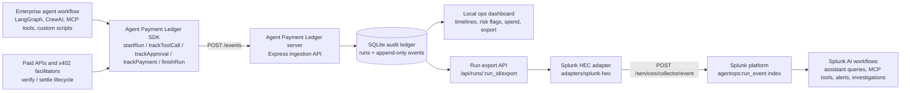

# Agent Payment Ledger Architecture

Agent Payment Ledger is an append-only payment-aware audit trail for autonomous agents. It records agent runs locally, renders an operations dashboard, exports audit JSON, and can forward run events into Splunk through HTTP Event Collector (HEC).

It is not affiliated with AgentOps.ai. Historical Splunk source and sourcetype names still use `agentops-ledger` / `agentops:run_event` because those names are part of the existing evidence packet.



## Runtime Data Flow

1. An agent starts a run with `startRun()`.
2. Each tool call, human approval gate, retry, error, payment, and final outcome is emitted as an event through the SDK.
3. The Express server persists events in SQLite and maintains a run summary for dashboard queries.
4. The dashboard groups events by run and highlights operational risk such as missing approvals, errors, retries, and unfinished runs.
5. `/api/runs/:run_id/export` returns the complete audit packet for one run.
6. The Splunk HEC adapter reads that export and forwards each event as a Splunk event with `sourcetype=agentops:run_event`.

## Splunk Event Shape

Each run event is sent as newline-delimited HEC JSON:

```json
{
  "index": "agentops",
  "source": "agentops-ledger",
  "sourcetype": "agentops:run_event",
  "time": 1779066000,
  "event": {
    "run_id": "run_demo_vendor_blocked",
    "agent": "vendor-risk-agent",
    "workflow": "vendor-risk-review",
    "run_status": "blocked",
    "event_type": "approval",
    "approval_status": "rejected"
  }
}
```

Once indexed, Splunk can treat agent behavior as operational telemetry: search failed runs, alert on rejected approvals, correlate x402 spend with incidents, and let Splunk AI workflows reason over the same evidence humans inspect in the dashboard.

## Core Components

- `sdk/`: TypeScript SDK for run and event instrumentation.
- `server/`: Express + SQLite ingestion API, run export API, deterministic seed data, and dashboard.
- `adapters/facilitator-x402/`: x402 facilitator lifecycle adapter.
- `adapters/splunk-hec/`: Splunk HTTP Event Collector exporter for selected run audits.
- `docs/hackathon/`: submission copy, visibility kit, and demo assets.

