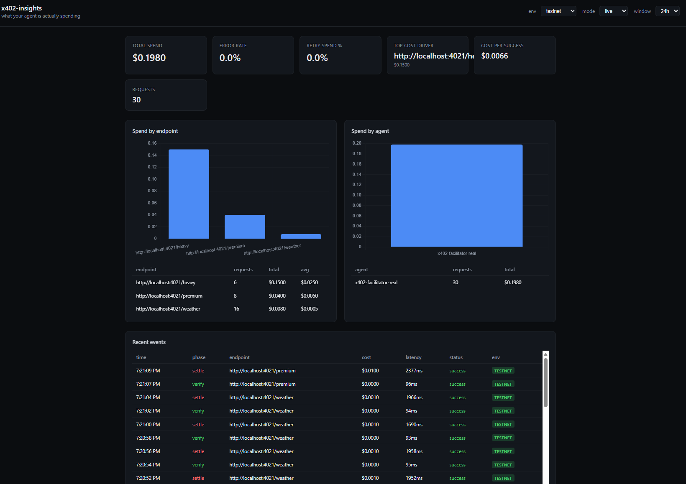

# x402-insights

See what your agent is spending — in real time.



## One-line install

```ts
import { attachInsights } from "@x402-insights/facilitator";

attachInsights(facilitator, {
  baseUrl: "http://localhost:4000",
  apiKey: "dev-key",
  source: "my-facilitator",
});
// That's it. Every verify and settle now emits spend events.
```

## What you get

- **Spend by endpoint** — which API calls cost the most
- **Retry waste** — how much you're spending on failed retries
- **Verify vs settle latency** — see that ~95% of facilitator time is settlement, not verification
- **Error rate** — which endpoints are failing and how much that costs
- **Live dashboard** — auto-refreshing, filterable by environment (testnet / dev)

## Tested on real traffic

30 Base Sepolia transactions through a live x402 facilitator. Not simulated.

Biggest finding: settle latency (~2,000ms) dominates verify (~95ms) by 20:1. If you're optimizing x402 flows, the bottleneck is `transferWithAuthorization`, not RPC reads or signature checks.

## Quick start

```bash
# Start the dashboard + event ingestion server
cd server && npm install && node server.js
# http://localhost:4000

# Seed demo data (optional)
node seed.js
```

## Project structure

```
sdk/                        Core SDK — trackX402() wrapper for any x402 call
adapters/facilitator-x402/  Drop-in adapter for x402Facilitator hooks (6 lifecycle hooks)
server/                     Express + SQLite ingestion API + dashboard
examples/                   Reference integrations (require x402 workspace)
```

## SDK (generic wrapper)

For any x402 call, not just facilitators:

```ts
import { configure, trackX402 } from "x402-insights";

configure({ baseUrl: "http://localhost:4000", apiKey: "dev-key" });

const result = await trackX402({
  agent: "my-agent",
  workflow: "search",
  endpoint: "embed",
  cost: 0.0001,
  fn: () => callEndpoint(),
});
```

## Facilitator adapter

Hooks into the 6 lifecycle events on any `x402Facilitator` instance:

| Hook | Phase | What it captures |
|------|-------|-----------------|
| `onBeforeVerify` | verify | Start timer |
| `onAfterVerify` | verify | Latency, valid/invalid, endpoint |
| `onVerifyFailure` | verify | Error details |
| `onBeforeSettle` | settle | Start timer |
| `onAfterSettle` | settle | Latency, cost (from `requirements.amount`), tx result |
| `onSettleFailure` | settle | Error, cost of failed settlement |

## Leaderboard tracker

`x402_leaderboard_tracker.py` scrapes x402scan's public tRPC endpoint daily and stores snapshots in SQLite (`x402_leaderboard.db`).

**Tracks per entry:** merchant, origin, facilitator, txn count, volume, unique buyers, chain.

**Day-over-day diffs:** new entrants, dropoffs, volume movers (>20% change), rank changes.

```bash
# Fetch latest snapshot
python x402_leaderboard_tracker.py

# View last snapshot without fetching
python x402_leaderboard_tracker.py --report
```

Runs on a daily cron at 8AM.

## v1 scope (intentional)

- Manual cost input on SDK calls (auto-capture from x402 headers is next)
- Single API key auth
- SQLite (swap to Postgres when needed)
- No auth on the dashboard

These are deliberate scope cuts, not missing features.

## License

MIT
