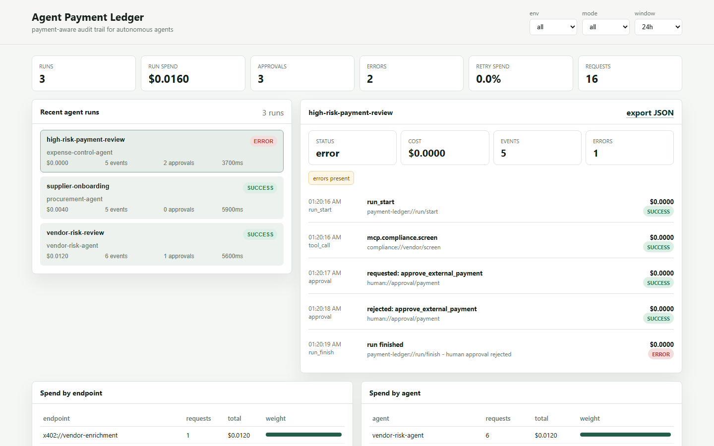

# AgentOps Ledger

Flight recorder for enterprise agents. Record every tool call, approval gate, retry, error, payment, and final outcome in one local audit trail.

AgentOps Ledger extends the original `x402-insights` spend observability project into a broader operations console for autonomous agents. The goal is simple: when an agent touches real systems, teams should be able to inspect exactly what happened.



## What It Shows

- Recent agent runs with status, spend, events, approvals, errors, and duration
- Run timelines with tool calls, human approvals, retries, payments, and final outcome
- Risk flags for errors, retries, missing approvals, and unfinished runs
- Spend by endpoint and by agent
- Exportable audit JSON for a selected run

## Quick Start

```powershell
cd server
npm install
npm run start
```

In another terminal:

```powershell
cd server
npm run seed
```

Open:

```text
http://localhost:4000
```

## SDK Example

```ts
import {
  configure,
  startRun,
  trackToolCall,
  trackApproval,
  trackPayment,
  finishRun,
} from "x402-insights";

configure({
  baseUrl: "http://localhost:4000",
  apiKey: "dev-key",
  defaultSource: "vendor-risk-demo",
  defaultEnvironment: "dev",
});

const run_id = await startRun({
  agent: "vendor-risk-agent",
  workflow: "vendor-risk-review",
});

await trackToolCall({
  run_id,
  agent: "vendor-risk-agent",
  workflow: "vendor-risk-review",
  step_name: "search_vendor_records",
  tool_name: "mcp.elastic.search",
  endpoint: "elastic://vendors/_search",
  fn: async () => searchVendorRecords(),
});

await trackApproval({
  run_id,
  agent: "vendor-risk-agent",
  workflow: "vendor-risk-review",
  step_name: "approve_paid_enrichment",
  approval_status: "approved",
});

await trackPayment({
  run_id,
  agent: "vendor-risk-agent",
  workflow: "vendor-risk-review",
  endpoint: "x402://vendor-enrichment",
  provider: "base-sepolia/exact",
  phase: "settle",
  cost: 0.012,
  currency: "USDC",
});

await finishRun({
  run_id,
  agent: "vendor-risk-agent",
  workflow: "vendor-risk-review",
  status: "success",
  summary: "Vendor cleared after records search, approval, and paid enrichment.",
});
```

## API

The server accepts append-only events at:

```text
POST /events
```

Dashboard APIs:

```text
GET /api/runs
GET /api/runs/:run_id
GET /api/runs/:run_id/export
GET /api/overview
GET /api/by-endpoint
GET /api/by-agent
```

## Architecture

See [ARCHITECTURE.md](ARCHITECTURE.md) for the data-flow diagram, run export shape, and Splunk HEC integration path.

## x402 Payment Observability

The original x402 instrumentation still works. `trackX402()` emits payment events, and the facilitator adapter can attach to x402 facilitator lifecycle hooks.

```ts
import { attachInsights } from "@x402-insights/facilitator";

attachInsights(facilitator, {
  baseUrl: "http://localhost:4000",
  apiKey: "dev-key",
  source: "my-facilitator",
});
```

Every verify and settle hook can be logged into the same ledger as normal agent tool calls and approvals.

## Splunk Export

The Splunk HEC adapter exports one selected run audit into Splunk as `agentops:run_event` telemetry.

```powershell
$env:AGENTOPS_BASE_URL = "http://localhost:4000"
$env:AGENTOPS_RUN_ID = "run_demo_vendor_blocked"
$env:SPLUNK_HEC_URL = "https://splunk.example:8088"
$env:SPLUNK_HEC_TOKEN = "<hec-token>"
$env:SPLUNK_INDEX = "agentops"

node adapters/splunk-hec/export-run-to-hec.mjs
```

## Project Structure

```text
sdk/                        TypeScript SDK
adapters/facilitator-x402/  x402 facilitator adapter
adapters/splunk-hec/        Splunk HTTP Event Collector exporter
server/                     Express + SQLite ingestion API + dashboard
examples/                   Reference integrations
docs/hackathon/             Submission copy and demo script
```

## Verification

```powershell
cd sdk
npm install
npm test

cd ../server
npm install
npm test

node ../adapters/splunk-hec/test-export-run-to-hec.mjs
```

Expected:

```text
sdk smoke test passed
server smoke test passed
splunk hec export test passed
```

## Hackathon Positioning

- **NandaHack:** trust and operations infrastructure for enterprise agents.
- **Splunk Agentic Ops:** agent-run telemetry exported through HEC into ops/security workflows.
- **Google Rapid Agent:** MCP-style tool observability for Gemini/agent workflows.
- **UiPath AgentHack:** human-in-the-loop audit layer around enterprise agent orchestration.

## License

MIT
