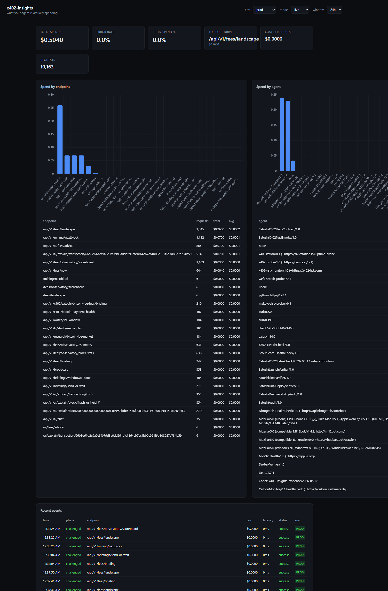

# Satoshi API Paid-Call Demo

This note documents a local dogfood run that ties `x402-insights` to real Satoshi API x402 payment/challenge telemetry.

## Live Route

Public paid endpoint:

```text
https://bitcoinsapi.com/api/v1/fees/landscape
```

Observed behavior on May 18, 2026:

- HTTP status: `402 Payment Required`
- price header: `x-price-usd: $0.005`
- start page: `https://bitcoinsapi.com/x402/start`
- free preview: `https://bitcoinsapi.com/api/v1/fees/recommended`
- AgentCash retry command:

```powershell
npx agentcash@latest fetch "https://bitcoinsapi.com/api/v1/fees/landscape" --payment-network base --max-amount 0.005
```

## Dashboard Evidence



The screenshot shows the local dashboard filtered to:

- environment: `prod`
- mode: `live`
- window: `24h`

It shows `/api/v1/fees/landscape` as the top cost driver and recent Satoshi events labeled `PROD`.

## Boundary

This is observability evidence, not revenue proof.

The dashboard's spend cards sum exported event cost for the selected local telemetry window. They are useful for debugging x402 spend, retries, and endpoint mix, but they are not source-classified business revenue.

For public Satoshi API revenue proof, use:

```text
https://bitcoinsapi.com/api/v1/x402-stats
```

That endpoint separates likely-organic x402 revenue from owner/test traffic.

## Use In A Case Study

Safe claim:

```text
x402-insights can observe Satoshi API production x402 payment/challenge telemetry locally, including paid-call paths such as /api/v1/fees/landscape.
```

Do not claim:

- that dashboard spend equals third-party revenue;
- that the screenshot alone proves a $100+ paid/funded/settled/claimable outcome;
- that a local dogfood run is an external customer reference.
